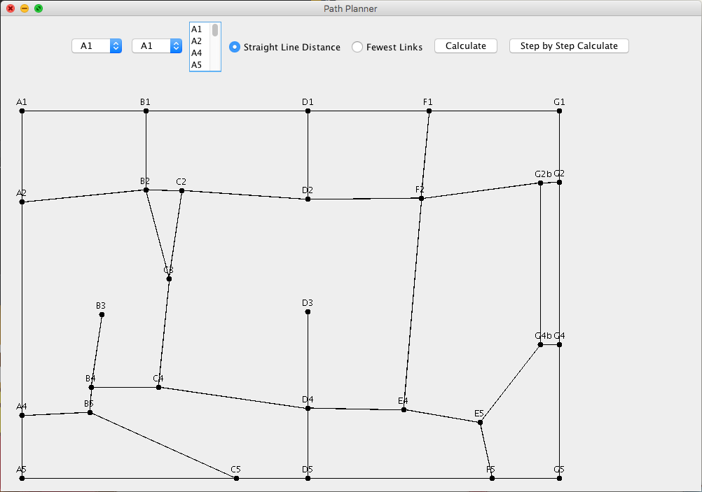
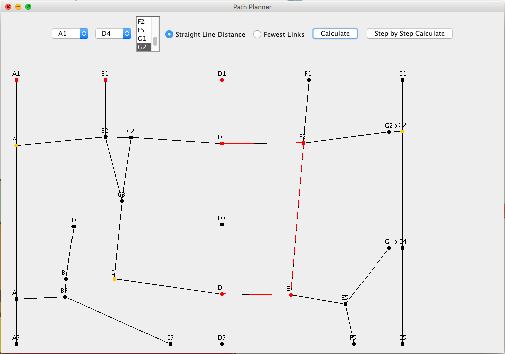

# PathPlanner

Description
--------
This program implements the A* algorithm in Java on an arbitrary map described through “connections” and “locations” file. The algorithm finds the optimal path between cities on a map that used two kinds of heuristics: the shortest distance and the least stops from start city to
end city (“Straight Line Distance” and the “Fewest Links").

